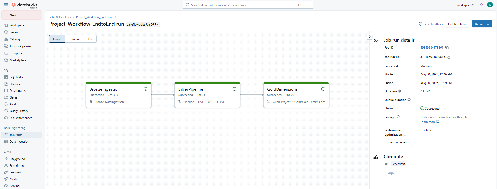

# Databricks_EndtoEnd_Project

### Overview
The Databricks_EndtoEnd_Project is designed to demonstrate a complete data pipeline using Databricks, from raw data ingestion to advanced analytics and reporting. The project is divided into three main layers: Bronze, Silver, and Gold.

## Bronze Layer

### Auto Loader:

- Purpose: Incrementally and efficiently processes new data files as they arrive in AWS cloud storage.
- Functionality:
- Uses Databricks Autoloader (cloudFiles) for streaming ingestion of CSV files.
    - Schema inference and evolution are enabled.
    - Writes ingested data as Delta tables to the Bronze layer with checkpointing for fault tolerance and exactly-once processing.
- Workflow:
    - Parameterization of the source folder using Databricks widgets for flexible ingestion.
    - Establishes the foundation for reliable, scalable, and incremental data ingestion.

## Silver Layer

### Delta Live Tables (DLT):

- Purpose: Transform and load data from the Bronze layer to the Silver layer.
- Functionality:
    - Automates orchestration, compute management, monitoring, and data quality.
    - Creates streaming tables and materialized views for both streaming and batch processing.
- Workflow:
    - Bookings Data: Reads, transforms, and applies data quality rules to create silver_bookings.
    - Flights Data: Reads, transforms, and sets up CDC flow to create silver_flights.
    - Customers Data: Reads, transforms, and sets up CDC flow to create silver_customers.
    - Airports Data: Reads, transforms, and sets up CDC flow to create silver_airports.
    - Business Views: Joins data from various silver tables to create comprehensive business views.

## Gold Layer

### Gold_Dimensions:

- Purpose: Transform and load data from the Silver layer to the Gold layer.
- Functionality:
    - Ensures data is up-to-date, accurate, and ready for advanced analytics and reporting.
- Workflow:
    - Parameter Creation: Defines parameters such as key columns, CDC column, source and target objects, and surrogate key using dbutils.widgets.
    - Data Transformation and Loading: Reads data from the Silver layer, applies necessary transformations, and loads it into the Gold layer.

This project demonstrates the end-to-end data pipeline capabilities of Databricks, ensuring data is processed incrementally, transformed accurately, and made ready for advanced analytics.

# Bronze Layer

**Auto Loader** incrementally and efficiently processes new data files as they arrive in cloud storage. It provides a Structured Streaming source called cloudFiles. Given an input directory path on the cloud file storage, the cloudFiles source automatically processes new files as they arrive, with the option of also processing existing files in that directory.

**Auto Loader Ingestion progress:** As files are discovered, their metadata is persisted in a scalable key-value store (RocksDB) in the checkpoint location of your Auto Loader pipeline. This key-value store ensures that data is processed exactly once. In case of failures, Auto Loader can resume from where it left off by information stored in the checkpoint location and continue to provide exactly-once guarantees when writing data into Delta Lake. You don't need to maintain or manage any state yourself to achieve fault tolerance or exactly-once semantics

The BronzeLayer notebook implements incremental data ingestion from raw files(Volume) into the Bronze layer of the Databricks Lakehouse. It uses Databricks Autoloader (`cloudFiles`) to efficiently ingest new and changed data from AWS cloud storage. The workflow includes:

- Parameterization of the source folder using Databricks widgets for flexible ingestion. 
- Incremental Data load: Ingest Data into Bronze layer using Autoloader(Dynamic Notebook)
- Streaming ingestion of CSV files from the raw data path, with schema inference and evolution enabled.
- Writing the ingested data as Delta tables to the Bronze layer, with checkpointing for fault tolerance and exactly-once processing.

This notebook establishes the foundation for reliable, scalable, and incremental data ingestion, preparing data for downstream processing in Silver and Gold layers.

# Silver Layer

**Delta Live Tables (DLT)** is a declarative framework designed to simplify data ingestion processes in Databricks. Built on Apache Spark, DLT automates orchestration, compute management, monitoring, and data quality. DLT allows you to create streaming tables and materialized views, which can be used for both streaming and batch processing. DLT is a powerful tool that accelerates ingestion processes, making it ideal when you need to quickly build a pipeline to deliver data to your lakehouse. 

The DLT_Silver_Pipeline.py script is designed to transform and load data from the Bronze layer to the Silver layer in a Databricks environment using Delta Live Tables (DLT). This process includes the following steps:

### Importing Required Libraries:

- The script imports necessary libraries from pyspark.sql.functions and pyspark.sql.types.

### Bookings Data:

- Stage Bookings Table: Reads incremental data from the Bronze layer and creates a streaming table named stage_bookings.
- Transform Bookings View: Transforms the stage_bookings data by casting columns, adding timestamps, and dropping unnecessary columns.
- Silver Bookings Table: Applies data quality rules to the transformed data and creates a streaming table named silver_bookings.

### Flights Data:

- Stage Flights View: Reads incremental data from the Bronze layer and transforms it by casting columns and adding timestamps.
- Silver Flights Table: Creates a streaming table named silver_flights and sets up a Change Data Capture (CDC) flow to handle updates.

### Customers Data:

- Stage Customers View: Reads incremental data from the Bronze layer and transforms it by adding timestamps.
- Silver Customers Table: Creates a streaming table named silver_customers and sets up a CDC(Type-1) flow to handle updates.

### Airports Data:

- Stage Airports View: Reads incremental data from the Bronze layer and transforms it by adding timestamps.
- Silver Airports Table: Creates a streaming table named silver_airports and sets up a CDC flow to handle updates.

### Silver Business View:

- Silver Business Table: Joins data from silver_bookings, silver_customers, silver_flights, and silver_airports to create a comprehensive business view (currently commented out).

### Silver Materialized View:

- Silver Business Materialized Table: Creates a materialized view from the silver_business table (currently commented out).

This script ensures that data in the Silver layer is cleansed, enriched, and ready for further processing and analysis.

# Gold Layer

This process ensures that the data in the Gold layer is up-to-date, accurate, and ready for advanced analytics and reporting.

The Gold_Dimensions notebook is designed to transform and load data from the Silver layer to the Gold layer in the Databricks Lakehouse architecture. This process includes the following steps:

### Parameter Creation:

- Parameters such as key columns, CDC column, backdated refresh, source object, source schema, target schema, target object, and surrogate key are defined using dbutils.widgets.

### Fetching Parameters and Creating Variables:

- The parameters are fetched and stored in variables for further use in the transformation process.
- Example parameters include:
- catalog: The catalog name (e.g., "workspace").
- key_cols: List of key columns (e.g., ['airport_id']).
- cdc_col: The CDC (Change Data Capture) column (e.g., modifiedDate).
- source_object: The source object (e.g., silver_airports).
- source_schema: The source schema (e.g., silver).
- target_schema: The target schema (e.g., gold).
- target_object: The target object (e.g., dimairports).
- surrogate_key: The surrogate key for the target object (e.g., dimairportsKey).

### Data Transformation and Loading:

- Data is read from the specified source object in the Silver layer.
- Necessary transformations are applied, including handling CDC(Type-1) and key columns.
- The transformed data is then loaded into the target object in the Gold layer.

This process ensures that the data in the Gold layer is up-to-date, accurate, and ready for advanced analytics and reporting.

