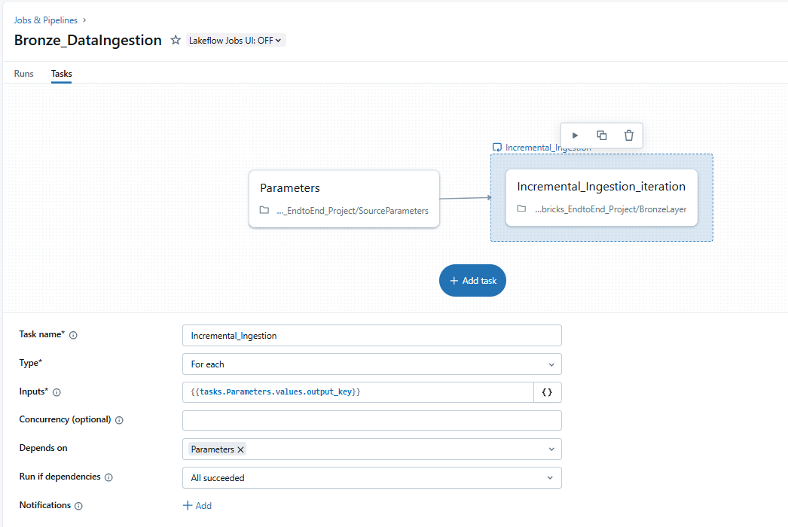
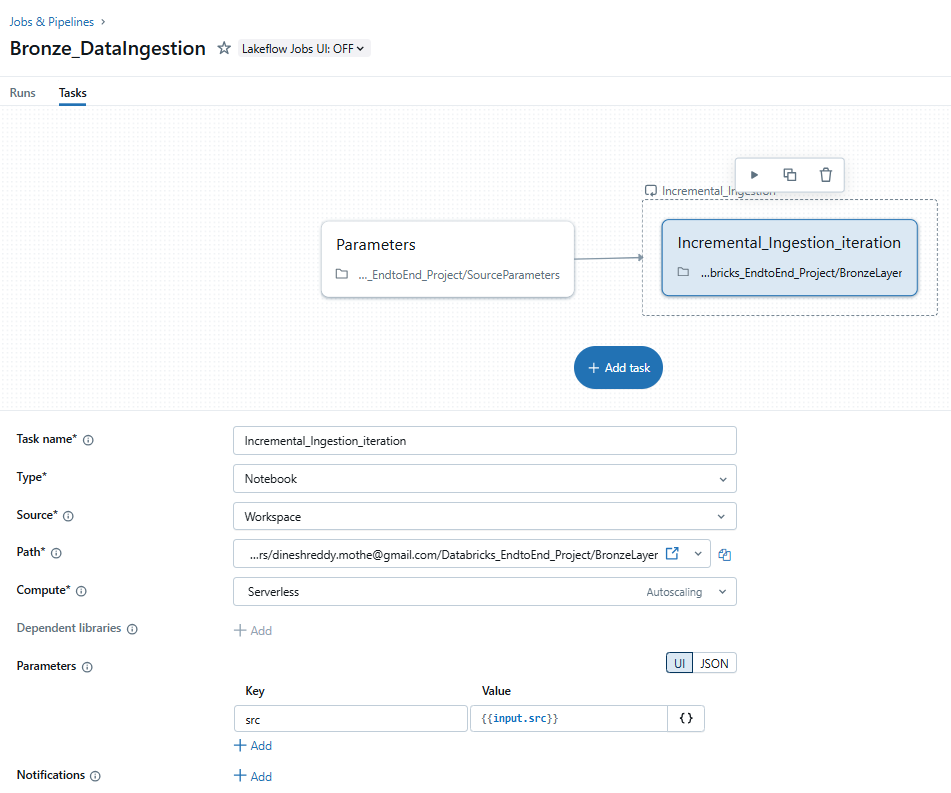
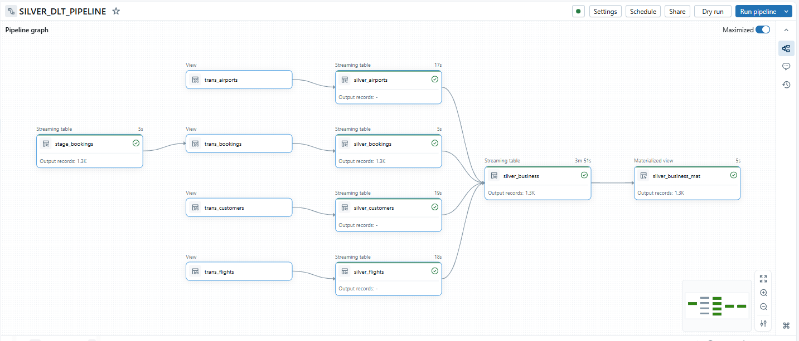

# Databricks_EndtoEnd_Project

###Bronze Layer

- Extract Data into Volumes
- Incremental Data load: Ingest Data into Bronze layer using Autoloader(Dynamic Notebook)

**Auto Loader** incrementally and efficiently processes new data files as they arrive in cloud storage. It provides a Structured Streaming source called cloudFiles. Given an input directory path on the cloud file storage, the cloudFiles source automatically processes new files as they arrive, with the option of also processing existing files in that directory.

**Auto Loader Ingestion progress:** As files are discovered, their metadata is persisted in a scalable key-value store (RocksDB) in the checkpoint location of your Auto Loader pipeline. This key-value store ensures that data is processed exactly once. In case of failures, Auto Loader can resume from where it left off by information stored in the checkpoint location and continue to provide exactly-once guarantees when writing data into Delta Lake. You don't need to maintain or manage any state yourself to achieve fault tolerance or exactly-once semantics

 

###Silver Layer

- Using Delta Live Tables(Lakeflow Declarative Pipelines called as DLT earlier) to Perform few transformations
- Load Data into Silver layer using Dynamic SCD Type-2 Logic 

**Delta Live Tables (DLT)** is a declarative framework designed to simplify data ingestion processes in Databricks. Built on Apache Spark, DLT automates orchestration, compute management, monitoring, and data quality. DLT allows you to create streaming tables and materialized views, which can be used for both streaming and batch processing.

DLT is a powerful tool that accelerates ingestion processes, making it ideal when you need to quickly build a pipeline to deliver data to your lakehouse. It is particularly useful for:

✅ Incremental data transformation
✅ Change Data Capture (CDC) support
✅ Type 2 Slowly Changing Dimensions (SCD2)

### # Gold Layer